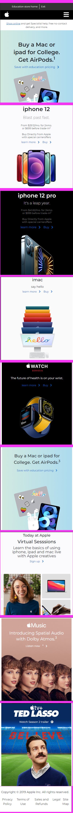
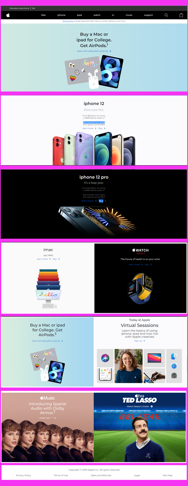

# apple-web-clone
>This project is a clone of one of the apple's web pages. In this project i used different front end  frame work,tools and language such as sass,bootsrap, linters,flex and grid layout.
### mobile 

### Desktop

### Built With

- HTML5
- CSS3
- JS

### Live Demo

[Visit the Live Demo](https://debas-31.github.io/apple-web-clone/)

### Authors

👤 **Debas Gebreslasie**

- [GitHub](https://github.com/Debas-31)
- [Twitter](https://twitter.com/DEBSH76956492)
- [LinkedIn](https://www.linkedin.com/in/debas-gebrengus-5256a2159/)

### 🤝 Contributing

Contributions, issues, and feature requests are welcome!

Feel free to check the [issues page](https://github.com/Debas-31/apple-web-clone/issues).

### Show your support

Give a ⭐️ if you like this project!

### Acknowledgments
- Apple technology company
- Bootstrap community

